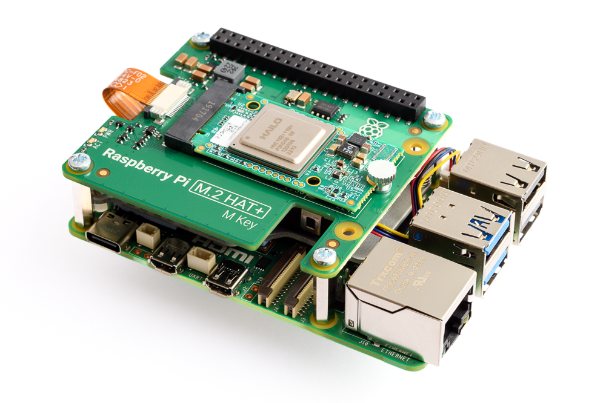

# Hailo Raspberry Pi 5 Examples

Welcome to the Hailo Raspberry Pi 5 Examples repository. This project showcases various examples demonstrating the capabilities of the Hailo AI processor on a Raspberry Pi 5. These examples will help you get started with AI on embedded devices.
Check out [Hailo Official Website](https://hailo.ai/) and [Hailo Community Forum](https://community.hailo.ai/) for more information.

## Table of Contents

- [Hailo Raspberry Pi 5 Examples](#hailo-raspberry-pi-5-examples)
  - [Table of Contents](#table-of-contents)
  - [Hailo Packages Installation](#hailo-packages-installation)
  - [Available Examples and Resources](#available-examples-and-resources)
    - [Hailo Dataflow Compiler (DFC) is now available](#hailo-dataflow-compiler-dfc-is-now-available)
    - [Hailo Examples](#hailo-examples)
      - [Basic Pipelines (Python)](#basic-pipelines-python)
      - [NEW: Retrained networks support](#new-retrained-networks-support)
        - [Detection Example](#detection-example)
        - [Pose Estimation Example](#pose-estimation-example)
        - [Instance Segmentation Example](#instance-segmentation-example)
      - [CLIP Application - Coming Soon](#clip-application---coming-soon)
    - [Raspberry Pi Official Examples](#raspberry-pi-official-examples)
      - [rpicam-apps](#rpicam-apps)
      - [picamera2 - Coming Soon](#picamera2---coming-soon)
  - [Contributing](#contributing)
  - [License](#license)
  - [Disclaimer](#disclaimer)



## Hailo Packages Installation

For installation instructions, see [Hailo Raspberry Pi 5 installation guide](doc/install-raspberry-pi5.md#how-to-set-up-raspberry-pi-5-and-hailo-8l).

## Available Examples and Resources

### Hailo Dataflow Compiler (DFC) is now available
The Hailo Dataflow Compiler (DFC) is a software tool that enables developers to compile their neural networks to run on the Hailo-8/8L AI processors. 
The DFC is available for download from the [Hailo Developer Zone](https://hailo.ai/developer-zone/software-downloads/) (Registration required).
For examples, tutorials, and retrain instructions, see [Hailo Model Zoo Repo](https://github.com/hailo-ai/hailo_model_zoo).
Additional documentation and [tutorials](https://hailo.ai/developer-zone/documentation/dataflow-compiler/latest/?sp_referrer=tutorials/tutorials.html) can be found in the [Hailo Developer Zone Documentation](https://hailo.ai/developer-zone/documentation/).
For a full end-to-end training and deployment example, see the [Retraining Example](doc/retraining-example.md).
The Detection basic pipeline example includes support for retrained models. For more information, see [Using Retrained Models](doc/basic-pipelines.md#using-retrained-models).


### Hailo Examples

#### [Basic Pipelines (Python)](doc/basic-pipelines.md#hailo-rpi5-basic-pipelines)
  These pipelines are included in this repository. They demonstrate object detection, human pose estimation, and instance segmentation in an easy-to-use format.
  For installation instructions, see [Basic Pipelines Installation Guide](doc/basic-pipelines.md#installation).
  #### NEW: Retrained networks support
  This application includes support for using retrained detection models. For more information, see [Using Retrained Models](doc/basic-pipelines.md#using-retrained-models).

  ##### [Detection Example](doc/basic-pipelines.md#detection-example)
  
  ##### [Pose Estimation Example](doc/basic-pipelines.md#pose-estimation-example)
  
  ##### [Instance Segmentation Example](doc/basic-pipelines.md#instance-segmentation-example)
  
#### CLIP Application - Coming Soon
CLIP (Contrastive Language-Image Pretraining), Predict the most relevant text prompt on real-time video frames using the Hailo-8L AI processor.
### Raspberry Pi Official Examples
#### rpicam-apps
  Raspberry Pi [rpicam-apps](https://www.raspberrypi.com/documentation/computers/camera_software.html#rpicam-apps) Hailo post process examples.
  This is Raspberry Pi's official example for AI post-processing using the Hailo AI processor integrated into their CPP camera framework. 
  The documentation on how to use the rpicam-apps can be found [here](https://www.raspberrypi.com/documentation/accessories/ai-kit.html).
  To run an example from the rpicam-apps, follow the instructions below:
  Clone the rpicam-apps repository to get the JSON configuration files
  ```bash
  git clone --depth 1 https://github.com/raspberrypi/rpicam-apps.git
  ```
  Change directory to the assets folder and run the example
  ```bash
  cd rpicam-apps/assets/
  # Run the example
  rpicam-hello -t 0 --post-process-file hailo_yolov6_inference.json --lores-width 640 --lores-height 640
  ```
#### picamera2 - Coming Soon
  Raspberry Pi [picamera2](https://github.com/raspberrypi/picamera2) is the libcamera-based replacement for Picamera which was a Python interface to the Raspberry Pi's legacy camera stack. Picamera2 also presents an easy to use Python API.


## Contributing

We welcome contributions from the community. You can contribute by:
1. Opening a pull request.
2. Reporting issues and bugs.
3. Suggesting new features or improvements.
4. Joining the discussion on the [Hailo Community Forum](https://community.hailo.ai/).

## License

This project is licensed under the MIT License. See the [LICENSE](LICENSE) file for details.

## Disclaimer
This code example is provided by Hailo solely on an “AS IS” basis and “with all faults”. No responsibility or liability is accepted or shall be imposed upon Hailo regarding the accuracy, merchantability, completeness or suitability of the code example. Hailo shall not have any liability or responsibility for errors or omissions in, or any business decisions made by you in reliance on this code example or any part of it. If an error occurs when running this example, please open a ticket in the "Issues" tab.
