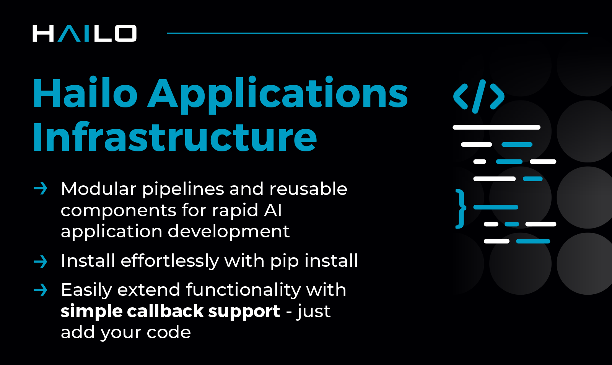

# Hailo Applications Infrastructure

This repository provides the core infrastructure and pipelines required to run Hailo application examples.
It is built to be used on multiple platforms, including Raspberry Pi 4 and 5, and x86_64 and aarch64 Ubuntu machines.
It includes ready-made pipelines for running detection, pose estimation, and instance segmentation examples. It includes common building block and utilities:
- Gstreamer Application class
- Gstreamer pipeline helper functions
- Post processing scripts
- Hailo HEF file loader

The infrastructure is aimed to provide tools for developers who want to create their own custom pipelines and applications. It can be 'pip installed' as a dependency in your own projects.
See more information in our [Development Guide](./doc/development_guide.md).

For more general information and support visit the [Hailo Official Website](https://hailo.ai/) and [Hailo Community Forum](https://community.hailo.ai/).

## Hailo examples code structure
`hailo-app-infra` is used as a dependency in other Hailo examples repositories. The following diagram shows the code structure of the Hailo examples repositories:


## Hailo Requirements
This repo requires Hailo's tools to be installed.
All the required packages can be found in [Hailo developer Zone SW downloads](https://hailo.ai/developer-zone/software-downloads/)
For Raspberry Pi users we have it all integrated in Raspberry Pi OS and apt server. See [Raspbery Pi installation Guide](https://github.com/hailo-ai/hailo-rpi5-examples/blob/main/doc/install-raspberry-pi5.md) on `hailo-rpi5-examples` repo for more information.

Required packages:
- HailoRT driver (deb package)
- HailoRT (deb package)
- HailoRT Python API (whl package)
- TAPPAS (Installer) or tappas-core (deb package)
- TAPPAS Python API (whl package)

## Using the Repository as a Pip Package
-----------------------------
To install the package, ensure you are inside a virtual environment with Hailo requirements installed. Then, run the following command:
```shell script
pip install git+https://github.com/hailo-ai/hailo-apps-infra.git
```
This will install the Hailo Applications Infrastructure package directly from the repository.

## Working Locally
To make changes and work with the code locally you can clone the repository and install it in editable mode:
```shell script
git clone https://github.com/hailo-ai/hailo-apps-infra.git
pip install --force-reinstall -v -e .
```
`--force-reinstall` is required to reinstall the package if it was already installed. By the hailo-rpi5-examples repository, for example. As part of the installation flow.

## Running the Pipelines
--------------------
The pipelines should be be imported and wrapped with your own application logic.
See examples in [Hailo RPi5 examples repo](https://github.com/hailo-ai/hailo-rpi5-examples/blob/main/README.md)

## Hailo Raspberry Pi Common Utilities
[Hailo Raspberry Pi Common Utilities](doc/development_guide.md)

## Contributing

We welcome contributions from the community. You can contribute by:
1. Contribute to our Community projects directories on other repos:
   1. [Hailo RPi5 examples Community Projects](https://github.com/hailo-ai/hailo-rpi5-examples/tree/main/community_projects/community_projects.md)
   2. [Hailo CLIP Community Projects](https://github.com/hailo-ai/hailo-CLIP/community_projects/community_projects.md)
2. PRs to this repo will not be accepted.
3. Reporting issues and bugs.
4. Suggesting new features or improvements.
5. Joining the discussion on the [Hailo Community Forum](https://community.hailo.ai/).

License
----------
The infrastructure is released under the MIT license. Please see the [LICENSE](LICENSE) file for more information.


Disclaimer
----------
This code infrastructure is provided by Hailo solely on an “AS IS” basis and “with all faults”. No responsibility or liability is accepted or shall be imposed upon Hailo regarding the accuracy, merchantability, completeness or suitability of the code infrastructure. Hailo shall not have any liability or responsibility for errors or omissions in, or any business decisions made by you in reliance on this code infrastructure or any part of it. If an error occurs when running this infrastructure, please open a ticket in the "Issues" tab.

This infrastructure was tested on specific versions and we can only guarantee the expected results using the exact version mentioned above on the exact environment. The infrastructure might work for other versions, other environment or other HEF file, but there is no guarantee that it will.