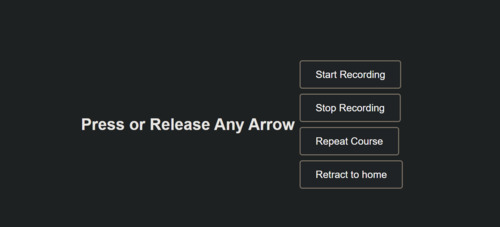

# NavigAItor: The AI-Powered Autonomous Path Navigator

## Overview
NavigAItor is an intuitive, AI-driven robot designed to autonomously navigate along a pre-recorded path. With simple button controls, it can move forward, backward, left, or right – all without the need for GPS or complex algorithms. Instead, NavigAItor uses pure intelligence to understand its environment.

By capturing images and creating a video-based map, NavigAItor constructs a "path story," similar to how a person might walk a trail, marking key landmarks to ensure they can retrace their steps. At the heart of this process, a neural network integrates interest point detection and descriptor extraction into a single, efficient model.

### Hackathon Video
[](https://youtu.be/E0Z55e1KyOo)

### Key Features
- **Remote Control**: Manage the Raspbot’s movement via a web-based server GUI.
- **Snapshot Capture**: Automatically take snapshots along the drive path for documentation.
- **AI-Powered Path Repetition**: Allow the robot to retrace its recorded path using only camera input, with no manual control.


## Installation

To get started with NavigAItor, follow these steps:

### Prerequisites
1. Get the Raspbot V2 AI Vision Robot Car for Raspberry Pi 5 and Raspberry Pi AI HAT+.

2. Launch & install basic flows for the Robot and AI-Kit according to manuals

3. Clone the repository:
    ```bash
    git clone https://github.com/hailo-ai/hailo-rpi5-examples.git
    ./install.sh
    . setup_env.sh
    cd community_projects/Navigaitor/
    pip install -r requirements.txt
    ```
4. Enable i2c:
    ```bash
    sudo raspi-config
    ```
    Choose 3 Interface-Options -> I5 I2C

5. Connect to your Raspbot:
    - Get the Raspbot’s IP address from the display.
    - Open a browser and navigate to the Raspbot server: `http://<ip_addr>:8000`.




## Usage - with Server

1. **Record a Path**:
   - Start recording mode and guide the robot along the desired path.
   - Stop recording when finished.

2. **Navigate and Retrace**:
   - Use the navigation buttons to bring the robot back to the starting point.
   - Activate "retreat mode" and watch the robot retrace its recorded path.

## Usage - without Server
1. **Simple example**
    Run the script to visualize the camera feed and see the rectangle move as you adjust the camera:
    ```bash
    python navigator.py
    ```
    Move the camera slightly and observe the rectangle's movement on screen.


2. **Record a Path**:
    To record a path while controlling the camera, use the following command:
    ```bash
    python navigator.py --navigate --record --cam 0
    ```
    As the camera moves, the robot will record the path, simulating movement like a driving car.

3. **Navigate and Retrace**:
    After you have recorded the path, you can retrace it by using the following command. This should start from the exact point where you began the recording:
    ```bash
    python navigator.py --navigate --retreat --cam 0
    ```
    The robot will retrace the recorded path from the point where the recording began and move back to the starting point.


To control the actual robot (car) in real-time while navigating and recording, add the -run-with-car flag

## Future Enhancements
- **Path Library**: Store and retrieve multiple paths of interest.
- **Reverse Path Navigation**: Retrace any recorded path in the reverse direction.
- **Start Anywhere**: Begin from any point along a recorded path.
- **Remote Monitoring**: Stream the Raspbot’s point of view (POV) in real-time, displaying the path as it’s retraced.


