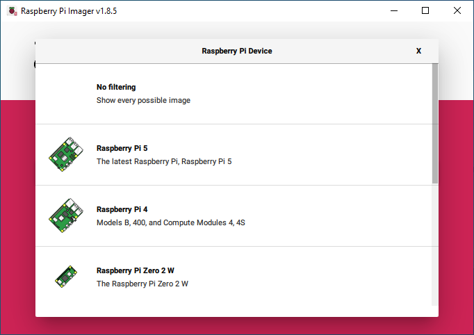
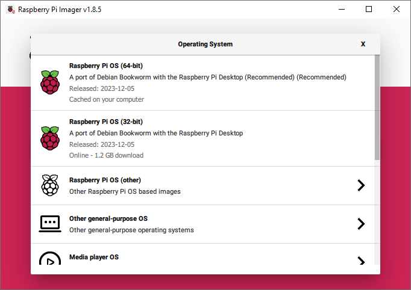

# How to setup Raspberry Pi 5 and Hailo-8L

In this guide, you will learn how to set up the Raspberry Pi 5 with a Hailo-8L AI accelerator.

## Table of Contents
- [What You'll Need](#what-youll-need)
- [Hardware](#hardware)
- [Software](#software)
- [Troubleshooting](#troubleshooting)

## What You'll Need
- Raspberry Pi 5
- Raspberry M.2 M-Key HAT
- Hailo8L M.2 module (Hailo-8 is also supported)
- Thermal pad
- Optional: Heat sink
- Optional: Raspberry Pi Camera Module v3
- Optional: USB camera

## Hardware
For this guide, the Raspberry Pi 5 (8 GB RAM) model with the official Active Cooler and 27W USB-C Power Supply was used. The official USB-C power supply is recommended to ensure the board can supply power to the M.2 HAT.


### Raspberry Pi M.2 M-Key HAT
The Raspberry Pi M.2 M-Key Hat can be used with the Hailo-8L M.2 key M or B+M. (Hailo-8 is also supported)
When installing the M.2 module, make sure to use the thermal pad to ensure proper heat dissipation.
If your project is encapsulated in a case, make sure to have proper ventilation to avoid overheating. If required, add a heat sink to the Hailo-8L module.


## Software

### Install Raspberry Pi OS
Download and install the latest Raspberry Pi Imager for your OS (Windows, macOS, or Ubuntu).

https://www.raspberrypi.com/software/

Select the Raspberry Pi 5.



Select Raspberry Pi OS (64-bit)



### Update System

```
sudo apt update
sudo apt upgrade
```
### Installing Requirements

#### Driver requirements
```bash
sudo apt-get install -y raspberrypi-kernel-headers \
build-essential dkms
```
#### TAPPAS requirements
```bash
sudo apt-get install -y rsync ffmpeg x11-utils python3-dev \
python3-pip python3-setuptools python3-virtualenv \
python-gi-dev libgirepository1.0-dev \
gcc-12 g++-12 cmake git libzmq3-dev \
libopencv-dev python3-opencv \
libcairo2-dev libgirepository1.0-dev \
libgstreamer1.0-dev libgstreamer-plugins-base1.0-dev \
libgstreamer-plugins-bad1.0-dev gstreamer1.0-plugins-base \
gstreamer1.0-plugins-good gstreamer1.0-plugins-bad \
gstreamer1.0-plugins-ugly gstreamer1.0-libav gstreamer1.0-tools \
gstreamer1.0-x gstreamer1.0-alsa gstreamer1.0-gl \
gstreamer1.0-gtk3 gstreamer1.0-qt5 gstreamer1.0-pulseaudio \
python-gi-dev python3-gi python3-gi-cairo gir1.2-gtk-3.0
```
Raspberry Pi 5, MIPI camera gstreamer requirements
```bash
sudo apt-get install -y gstreamer1.0-libcamera
```
#### You may need to run the following command to fix apt dependencies
```bash
sudo apt-get  --fix-broken install
```

### Set PCIe to Gen3
##### Setting Gen3 PCIe is required to get higher performance from the Hailo device.
Add the following line to /boot/firmware/config.txt 
```bash
sudo nano /boot/firmware/config.txt
# add the following line to the end of the file
dtparam=pciex1_gen=3
```
For more information see:
[Forcing PCI Express Gen 3.0 Speeds on Pi 5 - Jeff Geerling's Blog](https://www.jeffgeerling.com/blog/2023/forcing-pci-express-gen-30-speeds-on-pi-5)

### Install PCIe driver

```bash
sudo apt install hailort-pcie-driver
```
When asked "Do you wish to use DKMS? [Y/n]: " press "Y". 
### Installing HailoRT

```bash
sudo apt install hailort
```

When asked "Do you wish to activate hailort service? (required for most pyHailoRT use cases) [y/N]" press "N".
Service can be activated later if needed.

### Verify Installation
Now you can check if the Hailo chip is recognized by the system.
```bash
hailortcli fw-control identify
```
If everything is OK, it should output something like this:
```bash
Executing on device: 0000:01:00.0
Identifying board
Control Protocol Version: 2
Firmware Version: 4.16.0 (release,app,extended context switch buffer)
Logger Version: 0
Board Name: Hailo-8
Device Architecture: HAILO8
Serial Number: HLLWM2A224101556
Part Number: HM218B1C2FAE
Product Name: HAILO-8 AI ACC M.2 M KEY MODULE EXT TEMP
```
If you don't see this output, check the [PCIe troubleshooting](#pcie-troubleshooting) section.
### Install TAPPAS core

```bash
sudo apt install hailo-tappas-core
```

#### Installation should be completed by rebooting the system.
```bash
sudo reboot
```
#### Test installation by running the following commands:

Hailotools:
```bash
gst-inspect-1.0 hailotools
# expected result:
Plugin Details:
  Name                     hailotools
  Description              hailo tools plugin
  Filename                 /lib/aarch64-linux-gnu/gstreamer-1.0/libgsthailotools.so
  Version                  3.28.1
  License                  unknown
  Source module            gst-hailo-tools
  Binary package           gst-hailo-tools
  Origin URL               https://hailo.ai/

  hailoaggregator: hailoaggregator - Cascading
  hailocounter: hailocounter - postprocessing element
  hailocropper: hailocropper
  hailoexportfile: hailoexportfile - export element
  hailoexportzmq: hailoexportzmq - export element
  hailofilter: hailofilter - postprocessing element
  hailogallery: Hailo gallery element
  hailograytonv12: hailograytonv12 - postprocessing element
  hailoimportzmq: hailoimportzmq - import element
  hailomuxer: Muxer pipeline merging
  hailonv12togray: hailonv12togray - postprocessing element
  hailonvalve: HailoNValve element
```

Hailonet:
```bash
gst-inspect-1.0 hailo
# expected result:
Plugin Details:
  Name                     hailo
  Description              hailo gstreamer plugin
  Filename                 /lib/aarch64-linux-gnu/gstreamer-1.0/libgsthailo.so
  Version                  1.0
  License                  unknown
  Source module            hailo
  Binary package           GStreamer
  Origin URL               http://gstreamer.net/

  hailodevicestats: hailodevicestats element
  hailonet: hailonet element
  synchailonet: sync hailonet element

  3 features:
  +-- 3 elements
```
If hailo or hailotools are not found, try deleting the GStreamer registry.
```bash
rm ~/.cache/gstreamer-1.0/registry.aarch64.bin
```
##### If everything is ok you can continue installing the [hailo_rpi5_examples.](../README.md#configure-environment)

## Troubleshooting

### PCIe Troubleshooting
Make sure the PCIe board and the M.2 module are properly connected. To test if the PCIe board is recognized by the system, run the following command:
```bash
lspci | grep Hailo
```
If you get output like:
```bash
0000:01:00.0 Co-processor: Hailo Technologies Ltd. Hailo-8 AI Processor (rev 01)
```
Then the PCIe board is recognized by the system. If not, check the connection, power supply, and make sure the PCIe is enabled (see Raspberry Pi documentation). If the board is new, you may need to update the firmware of the Raspberry Pi 5.

### Driver Issue
If you get an error saying the Hailo driver is not installed, reinstall the driver and reboot the system.
```bash
"[HailoRT] [error] Can't find hailo pcie class, this may happen if the driver is not installed (this may happen if the kernel was updated), or if there is no connected Hailo board"
```
To reinstall the driver, run the following command again:
```bash
sudo dpkg --install hailort-pcie-driver_4.17.0_all.deb
```

## known issues
The issues below should be handled by the TAPPAS Core installation deb, but if you encounter them you can fix them manually.

### PCIe Page Size Issue
Add the following line to /etc/modprobe.d/hailo_pci.conf. You should create the file if it does not exist.
```txt
options hailo_pci force_desc_page_size=4096
```
You can do this with the following command. Sometimes there are permission issues, so you may need to use an editor with sudo rights. See below.
```bash
sudo echo 'options hailo_pci force_desc_page_size=4096' >> /etc/modprobe.d/hailo_pci.conf
```
If this does not work, open the file with nano and add the line manually.
(To save the file in nano, press Ctrl+X, then Y and Enter.)
```bash
sudo nano /etc/modprobe.d/hailo_pci.conf
```

### Cannot allocate memory in static TLS block
In some sceneraios (especially aarch64), you might experience the following error causing some Gstreamer plugins to not load correctly. 
The error message is:
```bash
(gst-plugin-scanner:67): GStreamer-WARNING **: 12:20:39.178: Failed to load plugin '/usr/lib/aarch64-linux-gnu/gstreamer-1.0/libgstlibav.so': /lib/aarch64-linux-gnu/libgomp.so.1: cannot allocate memory in static TLS block
```
This issue should be fixed by adding this to your .bashrc file:
```bash
echo 'export LD_PRELOAD=/usr/lib/aarch64-linux-gnu/libgomp.so.1' >> ~/.bashrc
```

If you already encountered this error, you can fix it by running the following commands:
```bash
export LD_PRELOAD=/usr/lib/aarch64-linux-gnu/libgomp.so.1
rm ~/.cache/gstreamer-1.0/registry.aarch64.bin
```
