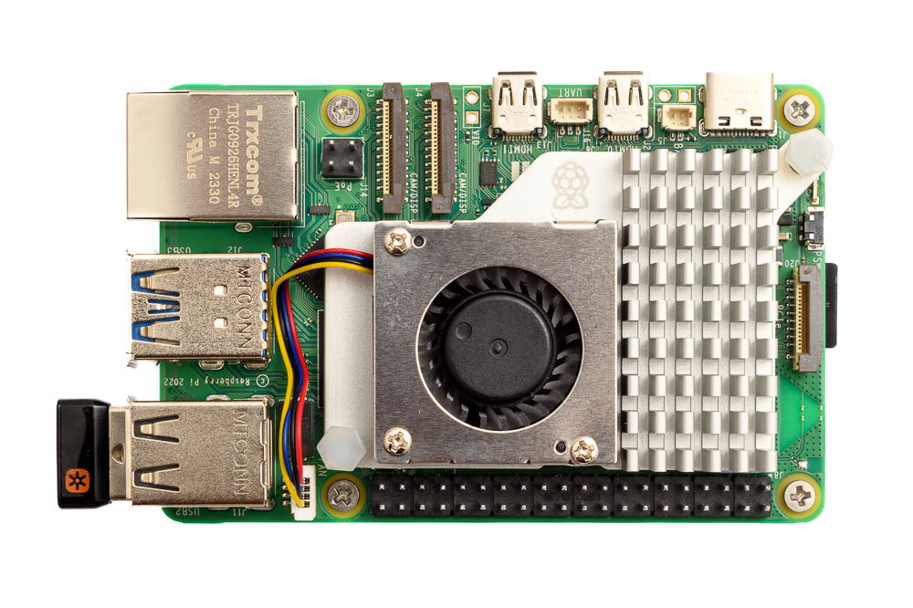
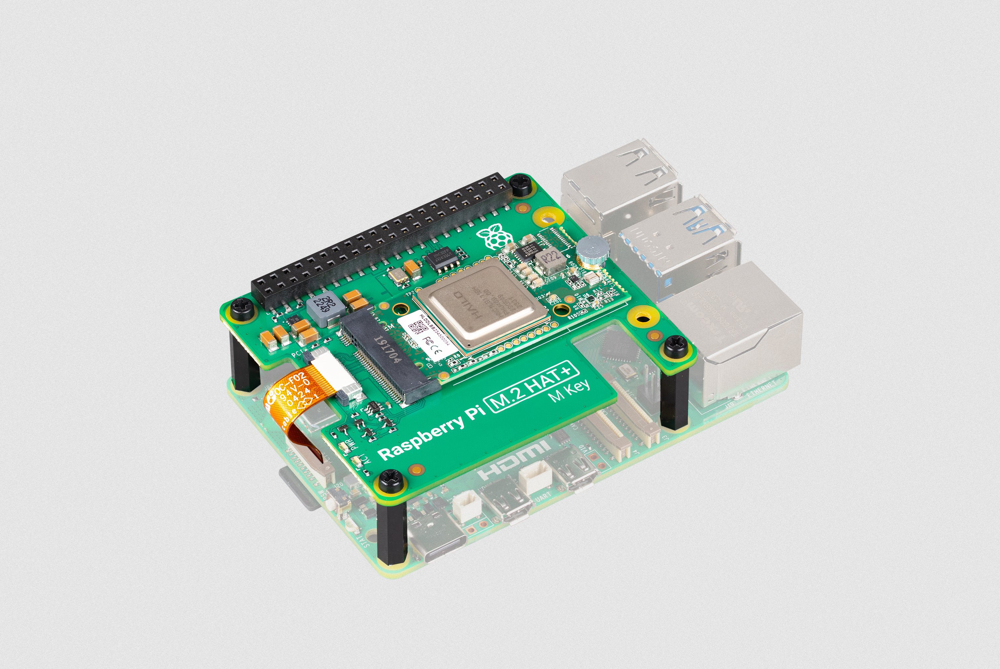
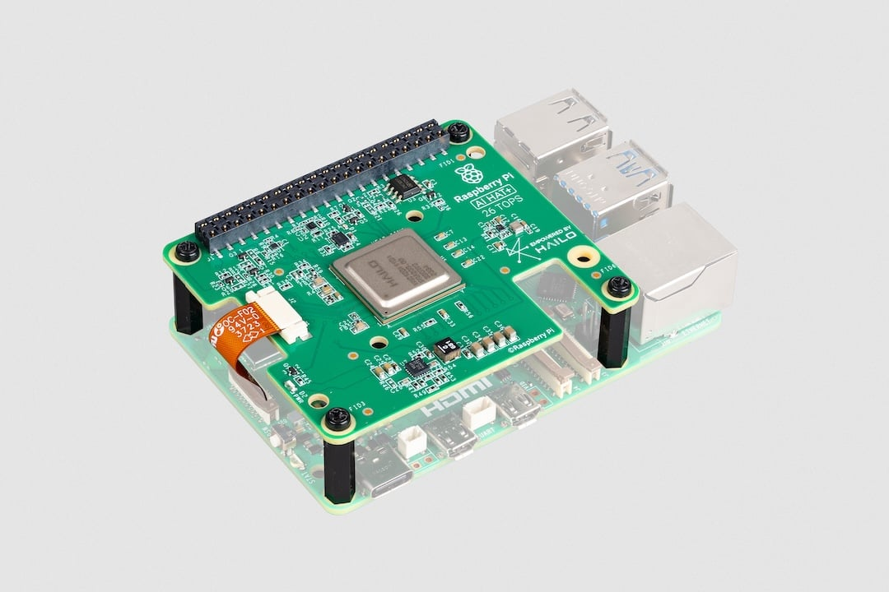

# How to Set Up Raspberry Pi 5 and Hailo

In this guide, you will learn how to set up the Raspberry Pi 5 with a Hailo-8/8L AI accelerator.

## Table of Contents
- [What You'll Need](#what-youll-need)
- [Hardware](#hardware)
- [Software](#software)
- [Troubleshooting](#troubleshooting)

## What You'll Need
- Raspberry Pi 5 (8GB recommended)
- Raspberry Pi 5 AI KIT (option 1)
  - Raspberry Pi M.2 M-Key HAT
  - Hailo-8L M.2 M-Key module (Hailo-8 is also supported)
- Raspberry Pi 5 AI HAT (option 2)
  - 26TOPs and 13TOPs are supported
- Active Cooler for the Raspberry Pi 5
- Optional: Heat sink
- Optional: An official Raspberry Pi camera (e.g., Camera Module 3 or High-Quality Camera)
- Optional: USB camera

## Hardware
For this guide, we used the Raspberry Pi 5 model along with the official Active Cooler and a 27W USB-C Power Supply. We recommend using the official USB-C power supply to ensure the board can adequately power the M.2 HAT.



### Raspberry Pi M.2 M-Key HAT
The Raspberry Pi M.2 M-Key HAT can be used with the Hailo-8L M.2 key M or B+M. (Hailo-8 is also supported).
When installing the M.2 module, make sure to use the thermal pad to ensure proper heat dissipation between the M.2 module and the HAT.
If your project is encapsulated in a case, make sure to have proper ventilation to avoid overheating. If required, add a heat sink to the Hailo-8L module.
For detailed instructions on how to install the M.2 module, follow [Raspberry Pi's official AI Kit Guide](https://www.raspberrypi.com/documentation/accessories/ai-kit.html#ai-kit).



### Raspberry Pi AI HAT
The Raspberry Pi AI HAT is a standalone board that includes the Hailo-8L AI accelerator. It is a plug-and-play solution that can be used with the Raspberry Pi 5.
When using the AI HAT, make sure to have proper ventilation to avoid overheating. If required, add a heat sink to the Hailo-8 module.
[Raspberry Pi's official AI HAT Guide](https://www.raspberrypi.com/documentation/accessories/ai-hat-plus.html#ai-hat-plus)


### Raspberry Pi Camera
See the [Raspberry Pi Camera Guide](https://www.raspberrypi.com/documentation/accessories/camera.html#install-a-raspberry-pi-camera) for instructions on how to install the camera.

## Software

### Install Raspberry Pi OS
Download and install the latest Raspberry Pi Imager for your OS (Windows, macOS, or Ubuntu) from [Raspberry Pi OS](https://www.raspberrypi.com/software/)

### Install your Raspberry Pi AI Kit or AI HAT
For AI Kit follow [Raspberry Pi's official AI Kit Guide](https://www.raspberrypi.com/documentation/accessories/ai-kit.html#ai-kit)

For AI HAT follow [Raspberry Pi's official AI HAT Guide](https://www.raspberrypi.com/documentation/accessories/ai-hat-plus.html#ai-hat-plus)

### Install Hailo Software
Follow the instructions on [Raspberry Pi's official AI Software Guide](https://www.raspberrypi.com/documentation/computers/ai.html#getting-started)

This will install the following software components:
- Hailo firmware
- HailoRT runtime software. See [HailoRT GitHub Repo](https://github.com/hailo-ai/hailort) for more information.
- Hailo TAPPAS Core package: A derivative of the TAPPAS repository, this core package includes GStreamer elements, post-processing functions, and additional tools used by this repository. It is essential for developing applications on the Pi but does not include standalone applications. See [Hailo TAPPAS GitHub](https://github.com/hailo-ai/tappas) for more information and documentation.
- The `rpicam-apps` Hailo post-processing software demo stages. See [Raspberry Pi Official Examples](../README.md#raspberry-pi-official-examples) for more information.

### Set PCIe to Gen3
To achieve optimal performance from the Hailo device, it is necessary to set PCIe to Gen3. While using Gen2 is an option, it will result in lower performance.
The Hailo AI HAT is auto detected as Gen3, but if you are using the M.2 HAT, you will need to set it manually.
Open the Raspberry Pi configuration tool:
```bash
sudo raspi-config
```
Select option "6 Advanced Options", then select option "A8 PCIe Speed". Choose "Yes" to enable PCIe Gen 3 mode. Click "Finish" to exit.

##### Reboot your Raspberry Pi.
```bash
sudo reboot
```

### Verify Installation
Now you can check if the Hailo chip is recognized by the system:
```bash
hailortcli fw-control identify
```
If everything is OK, it should output something like this:
```bash
Executing on device: 0000:01:00.0
Identifying board
Control Protocol Version: 2
Firmware Version: 4.17.0 (release,app,extended context switch buffer)
Logger Version: 0
Board Name: Hailo-8
Device Architecture: HAILO8L
Serial Number: N/A
Part Number: N/A
Product Name: N/A
```
Getting N/A for Serial Number, Part Number, and Product Name is normal for the AI HAT.

If you don't see this output, check the [PCIe troubleshooting](#pcie-troubleshooting) section.

#### Test TAPPAS Core installation by running the following commands:

Hailotools: (TAPPAS Gstreamer elements)
```bash
gst-inspect-1.0 hailotools
```
expected result:
```
Plugin Details:
  Name                     hailotools
  Description              hailo tools plugin
  Filename                 /lib/aarch64-linux-gnu/gstreamer-1.0/libgsthailotools.so
  Version                  3.28.2
  License                  unknown
  Source module            gst-hailo-tools
  Binary package           gst-hailo-tools
  Origin URL               https://hailo.ai/

  hailoaggregator: hailoaggregator - Cascading
  hailocounter: hailocounter - postprocessing element
  hailocropper: hailocropper
  hailoexportfile: hailoexportfile - export element
  hailoexportzmq: hailoexportzmq - export element
  hailofilter: hailofilter - postprocessing element
  hailogallery: Hailo gallery element
  hailograytonv12: hailograytonv12 - postprocessing element
  hailoimportzmq: hailoimportzmq - import element
  hailomuxer: Muxer pipeline merging
  hailonv12togray: hailonv12togray - postprocessing element
  hailonvalve: HailoNValve element
```

Hailonet: (HailoRT inference Gstreamer element)
```bash
gst-inspect-1.0 hailo
```
expected result:
```
Plugin Details:
  Name                     hailo
  Description              hailo gstreamer plugin
  Filename                 /lib/aarch64-linux-gnu/gstreamer-1.0/libgsthailo.so
  Version                  1.0
  License                  unknown
  Source module            hailo
  Binary package           GStreamer
  Origin URL               http://gstreamer.net/

  hailodevicestats: hailodevicestats element
  hailonet: hailonet element
  synchailonet: sync hailonet element

  3 features:
  +-- 3 elements
```
If `hailo` or `hailotools` are not found, try deleting the GStreamer registry:
```bash
rm ~/.cache/gstreamer-1.0/registry.aarch64.bin
```
##### If everything is OK you can continue installing the [hailo_rpi5_examples.](../README.md#configure-environment)

Don't forget to update our GitHub repository to the latest version to get the latest examples and resources.
```bash
cd [your-path]/hailo-rpi5-examples
git pull
```


## Troubleshooting
Got a question? Join the discussion on [Hailo Community Forum](https://community.hailo.ai/).
### PCIe Troubleshooting
Make sure the PCIe board and the M.2 module are properly connected. To test if the PCIe board is recognized by the system, run the following command:
```bash
lspci | grep Hailo
```
If you get output like:
```bash
0000:01:00.0 Co-processor: Hailo Technologies Ltd. Hailo-8 AI Processor (rev 01)
```
Then the PCIe board is recognized by the system. If not, check the connection, power supply, and make sure PCIe is enabled (see Raspberry Pi documentation). If the board is new, you may need to update the firmware of the Raspberry Pi 5.

### Driver Issue
If you get an error saying the Hailo driver is not installed, make sure your kernel version is greater than 6.6.31. You can get the kernel version by running:
```bash
uname -a
```
If the kernel version is lower than 6.6.31, you may need to run `apt update` and `apt full-upgrade` to update the kernel. If your kernel version is OK, reboot the system and try again.

## Known Issues
The issues below should be handled by the TAPPAS Core installation deb, but if you encounter them, you can fix them manually.

### PCIe Page Size Issue
Some hosts do not support certain PCIe descriptor page sizes. If you get an error like this:
```bash
[HailoRT] [error] CHECK_AS_EXPECTED failed - max_desc_page_size given 16384 is bigger than hw max desc page size 4096
```
Make sure the `/etc/modprobe.d/hailo_pci.conf` exists and contains the following line:
```bash
options hailo_pci force_desc_page_size=4096
```
Check the configuration:
```bash
cat /etc/modprobe.d/hailo_pci.conf
# expected result:
options hailo_pci force_desc_page_size=4096
```

### Cannot Allocate Memory in Static TLS Block
In some scenarios (especially aarch64), you might experience the following error causing some GStreamer plugins to not load correctly. The error message is:
```

bash
(gst-plugin-scanner:67): GStreamer-WARNING **: 12:20:39.178: Failed to load plugin '/usr/lib/aarch64-linux-gnu/gstreamer-1.0/libgstlibav.so': /lib/aarch64-linux-gnu/libgomp.so.1: cannot allocate memory in static TLS block
```
This issue should be fixed by adding this to your `.bashrc` file:
```bash
echo 'export LD_PRELOAD=/usr/lib/aarch64-linux-gnu/libgomp.so.1' >> ~/.bashrc
```
If you already encountered this error, you can fix it by running the following commands:
```bash
export LD_PRELOAD=/usr/lib/aarch64-linux-gnu/libgomp.so.1
rm ~/.cache/gstreamer-1.0/registry.aarch64.bin
```

