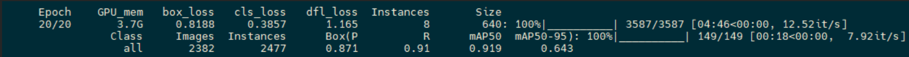
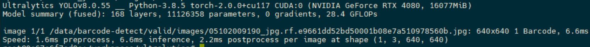
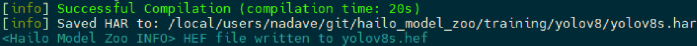

## Using YOLOv8 Retraining Docker 

In this example, we’re going to retrain the model to detect barcodes, using the barcode-detector dataset from Kaggle. After the retraining process, we’re going to convert the model to HEF and test it on the Raspberry Pi 5 AI Kit.

### This tutorial was made on a development machine with this spec 

**Hardware**:
- CPU: Intel i7-6850K
- GPU: RTX 4080

**Software**:
- OS: Ubuntu 20.04
- Hailo DFC version: 3.27.0
- Hailo Model-Zoo: 2.11.0

### On the development machine 

1. Install the Hailo AI SW-Suite from the [Developer Zone](https://hailo.ai/developer-zone/software-downloads/). Alternatively, you can download and install the DFC and the model-zoo into the same virtual environment.
2. Follow the instructions on the YOLOv8 retraining page: [YOLOv8 Retraining](https://github.com/hailo-ai/hailo_model_zoo/tree/833ae6175c06dbd6c3fc8faeb23659c9efaa2dbe/training/yolov8)
3. Note in this example we added volume mount with the name `data` to the Docker container.
4. Download the [barcode-detector](https://www.kaggle.com/datasets/kushagrapandya/barcode-detection) dataset from Kaggle. Make sure that it’s either mapped into the retraining Docker, or copied inside.

### Launch the retraining 

On my RTX 4080, it took about 3 hours:

```bash
yolo detect train data=/data/barcode-detect/data.yaml model=yolov8s.pt name=retrain_yolov8s epochs=20 batch=8
```

After the final epoch has finished, you should see a message like this:


### Validate the new checkpoint 

```bash
yolo predict task=detect source=/data/barcode-detect/valid/images/05102009190_jpg.rf.e9661dd52bd50001b08e7a510978560b.jpg model=./runs/detect/retrain_yolov8s/weights/best.pt
```
Expected output:

### Export the model to ONNX

```bash
yolo export model=/workspace/ultralytics/runs/detect/retrain_yolov8s/weights/best.pt imgsz=640 format=onnx opset=11
```

### Copy the ONNX to a directory mapped outside the Docker container

```bash
cp ./runs/detect/retrain_yolov8s/weights/best.onnx /data/barcode-detection.onnx
```

### Exit the Docker 

### Convert the model to Hailo 

Use the Hailo Model Zoo command (this can take up to 30 minutes):

```bash
hailomz compile yolov8s --ckpt=barcode-detection.onnx --hw-arch hailo8l --calib-path barcode-detect/test/images/ --classes 2 --performance
```
You should get a message like this: 


### Now, we have the yolov8s.hef. This file can be used on the Raspberry Pi 5 AI Kit.
For deployment instructions, see [Using Retrained Models](basic-pipelines.md#using-retrained-models).